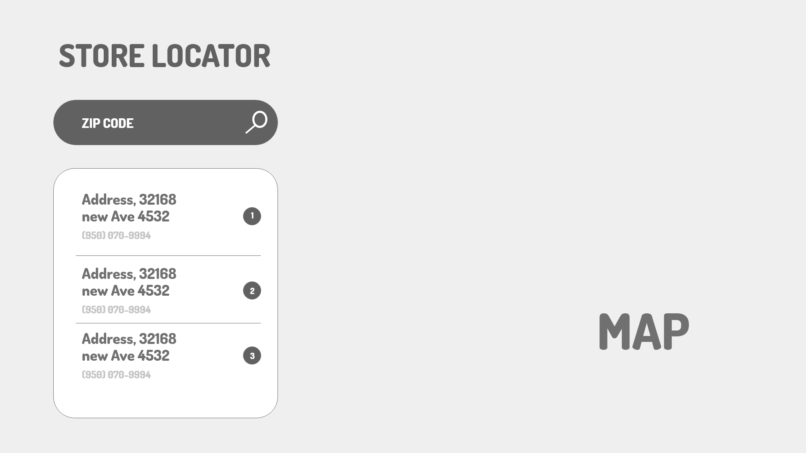
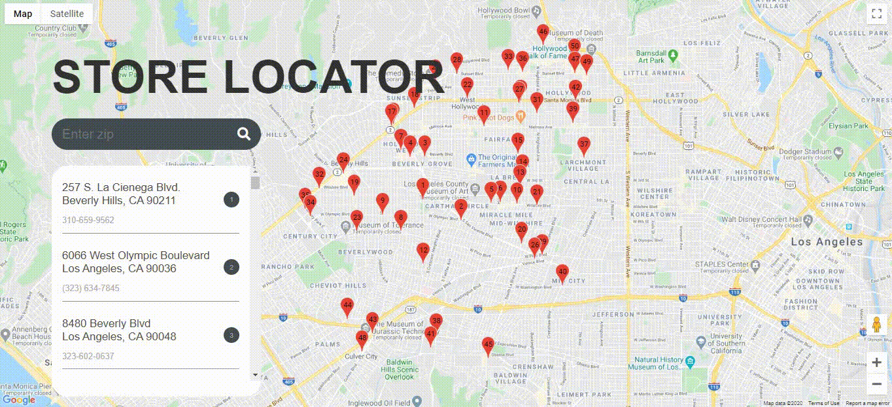
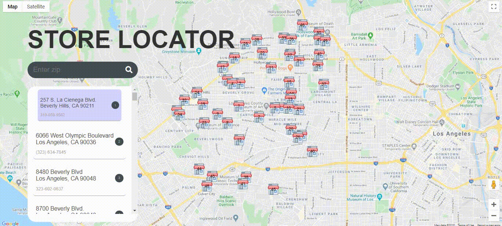

## Google Maps Challenge

The 6-Figure JavaScript Developer Challenge project where we built a store locator using the google map api

## Screenshots
<p align="center">
    <h3 align="center">Wireframe</h3>
    
</p>
<p align="center">
    <h3 align="center">Live app</h3>
    
</p>
<p align="center">
    <h3 align="center">my final touch</h3>
    
</p>

## Tools & Languages
- HTML5
- CSS3
- Javascript
- [Fontawesome](https://fontawesome.com/) for the icons
- [Figma](https://www.figma.com/) UI Design & we used it as a pallette for taking colors, fonts, sizes etc...
- [draw.io](https://app.diagrams.net/) for making the wireframe
- [fast.io](https://go.fast.io/) for hosting our apps(homeworks)
- [VSCode](https://code.visualstudio.com/) as a text editor

## Usage
>You need to get an api key from the official google [documentation](https://developers.google.com/maps/documentation/javascript/get-api-key)
>
Replace __YOUR_API_KEY__ with your key in ```index.html```
```html
<script async defer
    src="https://maps.googleapis.com/maps/api/js?key=YOUR_API_KEY&callback=initMap">
</script>
```

